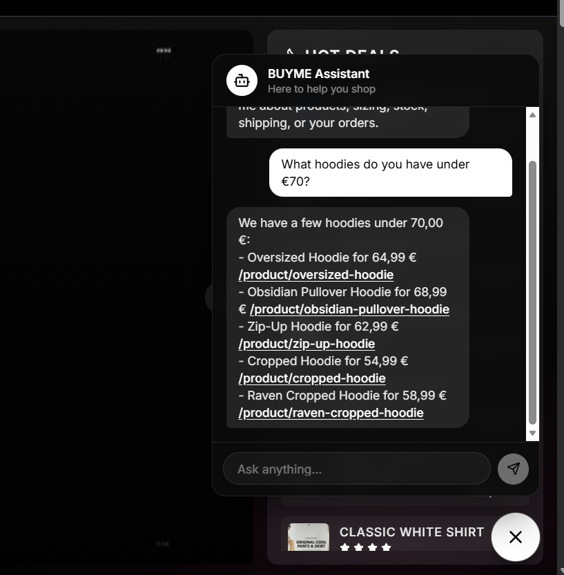

# 🛍️ BUYME AI Shopping Assistant

A floating, AI-powered shopping assistant for the BUYME storefront. It answers
questions about products, stock, prices, offers, sizing, shipping, loyalty
points, the user's cart, and their orders — grounded entirely on **real store
data**, so it never invents products or prices.

Built with **Google Gemini** (`gemini-2.5-flash`), Next.js App Router, and Prisma.

---

## 📸 Screenshots

**The shopping assistant in action:**



---

## ✨ Features

- **Grounded answers** — replies are built from the live product catalogue,
  inventory, active coupons, the signed-in user's orders, cart and loyalty
  balance. No hallucinated products, prices, or discounts.
- **Strict scope** — only helps with shopping on BUYME. Politely refuses
  off-topic requests (coding, general knowledge, etc.) and ignores jailbreak
  attempts.
- **Clickable product links** — internal paths like `/product/<slug>`, `/shop`
  and `/product/cartpage` render as real, clickable links. Paths are relative,
  so they work unchanged across localhost, Vercel previews, and custom domains.
- **Resilient** — every database read falls back gracefully (with one retry) if
  the DB is briefly unreachable (e.g. a Neon free-tier cold-start), so the
  assistant stays up instead of erroring out.
- **Abuse limits** — per-IP and per-user rate limits, payload/length caps, and a
  request timeout protect the API and your model quota.
- **Secure by design** — the Gemini API key lives only on the server; the
  browser only ever talks to `/api/chat`.

---

## 🏗️ Architecture

```
Browser (ChatWidget)
   │  POST /api/chat  { messages: [...] }
   ▼
app/api/chat/route.ts        ← auth, rate limits, validation, error mapping
   │
   ├─ lib/chat-context.ts    ← builds grounded "store context"
   │     • catalogue overview         (static: public/data/shop.ts)
   │     • relevant products + stock   (DB: Product)
   │     • active offers / coupons     (DB: Coupon)
   │     • user orders / cart / points (DB: Order, CartItem, User)
   │
   └─ lib/chat.ts            ← Gemini client, system prompt, timeout
         │
         ▼
   Google Gemini API → reply text → rendered in the widget
```

### Files

| File | Responsibility |
| --- | --- |
| [`components/chat/chat-widget.tsx`](../components/chat/chat-widget.tsx) | Floating launcher + chat panel UI; linkifies internal paths. Mounted site-wide, hidden on auth/admin routes. |
| [`hooks/provider.tsx`](../hooks/provider.tsx) | Mounts `<ChatWidget />` once for the whole app. |
| [`app/api/chat/route.ts`](../app/api/chat/route.ts) | Server endpoint: session, rate limiting, validation, error handling. |
| [`lib/chat.ts`](../lib/chat.ts) | Gemini model client, system prompt, generation + timeout. |
| [`lib/chat-context.ts`](../lib/chat-context.ts) | Assembles the grounded store context (catalogue + live DB data). |
| [`scripts/test-gemini.mjs`](../scripts/test-gemini.mjs) | Probe which Gemini models have working quota for your key. |

---

## ⚙️ Setup

### 1. Get a free Gemini API key
Create one at <https://aistudio.google.com/app/apikey> (free tier, no card).

### 2. Add environment variables
In `.env` (local) **and** your hosting provider (e.g. Vercel → Settings →
Environment Variables):

```bash
GEMINI_API_KEY="AIza..."          # required
GEMINI_MODEL="gemini-2.5-flash"   # optional — this is the default
```

> `.env` is gitignored and is **not** deployed — you must set these in the
> hosting dashboard separately, then redeploy.

### 3. Verify which models your key can use (optional)
```bash
node scripts/test-gemini.mjs
```
Prints ✅/❌ per model. If `gemini-2.5-flash` shows ✅ you're set. If a model
returns `429 quota limit: 0`, that model has no free tier on your project — pick
one that works and set it as `GEMINI_MODEL`.

### 4. Run
```bash
npm run dev
```
Open the site and click the 💬 button (bottom-right). Without a key, the widget
still renders but replies that it isn't configured.

---

## 🧠 How grounding works

On every message the server:

1. Tokenizes the user's question and finds matching products in the static
   catalogue (`public/data/shop.ts`).
2. Overlays **live stock & price** from the `Product` table.
3. Adds active **promo codes**, plus the signed-in user's **orders, cart, and
   loyalty points**.
4. Injects all of this into the system prompt as the model's *only* source of
   truth, with strict instructions not to invent anything.

If the database is briefly unreachable, each section falls back to static data
(or a soft "couldn't load that right now"), so the assistant never hard-fails.

---

## 🔒 Limits & safeguards

| Limit | Default | Purpose |
| --- | --- | --- |
| Per-minute / IP | 15 | Burst-spam guard |
| Per-day / IP | 200 | Quota / cost guard |
| Per-day / user | 300 | Stops IP-rotation abuse |
| Messages per request | 60 | Reject oversized payloads |
| Chars per message | 1000 | Reject giant prompts |
| History sent to model | 12 turns | Token / cost control |
| Model output | 500 tokens | Bounded responses |
| Model timeout | 20s | No hung requests |
| `maxDuration` | 30s | Serverless invocation cap |

> **Note:** rate limits use an in-memory store (`lib/rate-limit.ts`). On
> serverless this is per-instance and resets on cold start — a strong speed bump,
> not a hard global guarantee. For cross-instance limits, back `rateLimit()` with
> a shared store like [Upstash Redis](https://upstash.com/) — the call sites stay
> the same.

---

## 🚀 Deployment notes

- Set `GEMINI_API_KEY` (and optionally `GEMINI_MODEL`) in your host's env vars
  and **redeploy** — env changes don't apply to existing deployments.
- Product links are relative, so nothing needs changing per deploy URL.
- Confirm the live endpoint:
  ```bash
  curl -s -X POST https://YOUR-APP/api/chat \
    -H "Content-Type: application/json" \
    -d '{"messages":[{"role":"user","content":"what is on offer?"}]}'
  ```

---

## 🛠️ Extending

- **Switch model:** set `GEMINI_MODEL` (e.g. `gemini-2.5-flash-lite`).
- **Add knowledge:** extend `buildStoreContext()` in `lib/chat-context.ts`.
- **Add more linkable routes:** update the `INTERNAL_PATH` regex in
  `components/chat/chat-widget.tsx`.
- **Harden rate limits:** swap the in-memory limiter for Upstash Redis.
